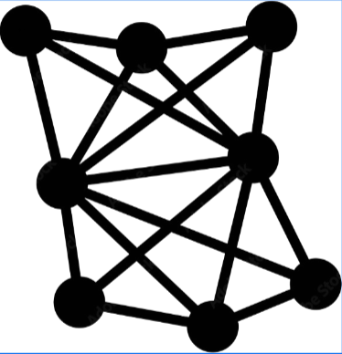

[![Commits][commits-shield]][commits-url]
[![Programs][programs-shield]][programs-url]
[![Lines][lines-shield]][lines-url]
[![Application Projects][apps-shield]][apps-url]
[![All Programs Pass Tests][appt-shield]][appt-url]
[![All Applications Contains Documentations][aacd-shield]][aacd-url]
[![Actively Updating][au-shield]][au-url]

<!-- PROJECT LOGO -->
<table border="0" cellspacing="0" cellpadding="0">
  <tr>
    <td style="vertical-align: middle;">
      
    </td>
    <td style="vertical-align: middle; padding-left: 15px;">
      <h3 style="margin: 0;">Algorithm & Applications Project Family</h3>
    </td>
  </tr>
</table>

  This project family includes popular algorithms' multi-language implementations programs and their applications on real-life software artifacts. Each algorithm group has several algorithms solving the same problem, and here, each algorithm has one program executing independently. Those similar algorithms are placed in the same module. Unit testing covers all implementations to ensure their execution reliability, and application projects apply these implementations in their designated places. Documentation aims to indicate main confusion places.

[![Python][python-shield]][python-url]
[![Java][java-shield]][java-url]
[![C++][cpp-shield]][cpp-url]
[![C][c-shield]][c-url]
[![C#][csharp-shield]][csharp-url]
[![JavaScript][js-shield]][js-url]
[![TypeScript][ts-shield]][ts-url]
[![Swift][swift-shield]][swift-url]
[![Go][go-shield]][go-url]
[![Scala][scala-shield]][scala-url]

[![JSON][json-shield]][json-url]
[![MongoDB][mdb-shield]][mdb-url]
[![pytest][pytest-shield]][pytest-url]
[![junit][junit-shield]][junit-url]
[![matlab][matlab-shield]][matlab-url]

<!-- TABLE OF CONTENTS -->

  
Table of Contents

  <ol>
    <li>
      <a href="#about-the-project">About The Project</a>
    </li>
    <li>
      <a href="#getting-started">Getting Started</a>
      <ul>
        <li><a href="#prerequisites">Prerequisites</a></li>
        <li><a href="#installation">Installation</a></li>
      </ul>
    </li>
    <li><a href="#usage">Usage</a></li>
    <li><a href="#roadmap">Roadmap</a></li>
    <li><a href="#contributing">Contributing</a></li>
    <li><a href="#license">License</a></li>
    <li><a href="#contact">Contact</a></li>
    <li><a href="#acknowledgments">Acknowledgments</a></li>
  </ol>

<!-- ABOUT THE PROJECT -->
## About The Project

**This project family includes those parts**

:open_mouth: **Algorithm implementations** (How do algorithm perform in the different programming languages?)

:smile: **Algorithm-based Application programs** (Apply algorithms to application programs)

:grimacing: **Documentations** (files that explain content, mainly **_.ipynb_** and **_.md_** files)

:blush: **Mathematical proofs** (algortihms' theory proofs, mostly based on selected textbooks)

:smiley: **Testing** (Testing that checks whether each program has good, expected performance)

Of course, no one template will serve all projects since your needs may be different. So I'll be adding more in the near future. You may also suggest changes by forking this repo and creating a pull request or opening an issue.

Every repository has the `README.md` file to briefly explain what does this repository do.

(<a href="#top">back to top</a>)

<!-- CONTACT -->
## Contact the Author

Email Address - david1147062956@gmail.com

Email Address - dai.jingze@icloud.com

Project Link: [https://github.com/daijingz/Algorithm-and-Design](https://github.com/daijingz/Algorithm-and-Design)

(<a href="#top">back to top</a>)

<!-- ACKNOWLEDGMENTS -->
## Acknowledgments

**_This part is from the README file template provider, NOT from the author_**

Use this space to list resources you find helpful and would like to give credit to. I've included a few of my favorites to kick things off!

* [Choose an Open Source License](https://choosealicense.com)
* [GitHub Emoji Cheat Sheet](https://www.webpagefx.com/tools/emoji-cheat-sheet)
* [Malven's Flexbox Cheatsheet](https://flexbox.malven.co/)
* [Malven's Grid Cheatsheet](https://grid.malven.co/)
* [Img Shields](https://shields.io)
* [GitHub Pages](https://pages.github.com)
* [Font Awesome](https://fontawesome.com)
* [React Icons](https://react-icons.github.io/react-icons/search)

(<a href="#top">back to top</a>)

[commits-shield]: https://img.shields.io/badge/Commits->4k-blue
[commits-url]: https://github.com/daijingz/Algorithm_Implementations/commits/main/
[programs-shield]: https://img.shields.io/badge/Sub_Projects->80-green
[programs-url]: https://github.com/daijingz/Algorithm_Implementations
[lines-shield]: https://img.shields.io/badge/Total_Lines->9300-cyan
[lines-url]: https://github.com/daijingz/Algorithm_Implementations
[apps-shield]: https://img.shields.io/badge/Application_Projects-4-yellow
[apps-url]: https://github.com/daijingz/Algorithm_Implementations/tree/main/Applications
[appt-shield]: https://img.shields.io/badge/All_Programs_Verified_By_Tests-purple
[appt-url]: https://github.com/daijingz/Algorithm_Implementations/tree/main/Testing
[aacd-shield]: https://img.shields.io/badge/All_Applications_Contain_Documentations-orange
[aacd-url]: https://github.com/daijingz/Algorithm_Implementations/tree/main/Documentation
[au-shield]: https://img.shields.io/badge/Actively_Updating-darkred
[au-url]: https://www.linkedin.com/in/jingze-dai/
[Bootstrap-url]: https://getbootstrap.com
[JQuery.com]: https://img.shields.io/badge/jQuery-0769AD?style=for-the-badge&logo=jquery&logoColor=white
[JQuery-url]: https://jquery.com

[python-shield]: https://img.shields.io/badge/Python-blue
[python-url]: https://www.python.org/
[java-shield]: https://img.shields.io/badge/Java-orange
[java-url]: https://www.java.com/en/
[cpp-shield]: https://img.shields.io/badge/C++-pink
[cpp-url]: https://docs.microsoft.com/en-us/cpp/?view=msvc-170
[c-shield]: https://img.shields.io/badge/C-yellow
[c-url]: https://learn.microsoft.com/en-us/cpp/c-language/?view=msvc-170
[csharp-shield]: https://img.shields.io/badge/CSharp-green
[csharp-url]: https://learn.microsoft.com/en-us/dotnet/csharp/
[js-shield]: https://img.shields.io/badge/JavaScript-lightyellow
[js-url]: https://devdocs.io/javascript/
[ts-shield]: https://img.shields.io/badge/TypeScript-lightblue
[ts-url]: https://devdocs.io/typescript/
[swift-shield]: https://img.shields.io/badge/Swift-purple
[swift-url]: https://devdocs.io/swift/
[go-shield]: https://img.shields.io/badge/Go-brown
[go-url]: https://devdocs.io/go/
[scala-shield]: https://img.shields.io/badge/Scala-lightgreen
[scala-url]: https://devdocs.io/scala/

[json-shield]: https://img.shields.io/badge/JSON-grey
[json-url]: https://www.json.org/json-en.html
[mdb-shield]: https://img.shields.io/badge/MongoDB-darkgreen
[mdb-url]: https://www.mongodb.com/
[pytest-shield]: https://img.shields.io/badge/pytest-skyblue
[pytest-url]: https://docs.pytest.org/en/stable/
[junit-shield]: https://img.shields.io/badge/JUnit-lightorange
[junit-url]: https://junit.org/junit5/
[matlab-shield]: https://img.shields.io/badge/MATLAB-darkblue
[matlab-url]: https://www.mathworks.com/products/matlab.html
